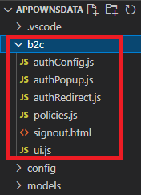

# Power BI Embedded の Web サイトにAzure AD B2C 認証を設定

## 概要
　本サンプルは Power BI Embedded の WEB サイトに Azure AD B2C の認証機能を追加した物となります。システムの全体構成は以下となります。

   

### クラウド実行環境
- Azure App Service : Linux ベース環境
- Node 16

### ベースサンプル (NodeJS)
- [Power BI 開発者サンプル](https://github.com/microsoft/PowerBI-Developer-Samples)
- [ms-identity-b2c-javascript-spa](https://github.com/Azure-Samples/ms-identity-b2c-javascript-spa)

　本サンプルは、上記 Power BI 開発者サンプルに ms-identity-b2c-javascript-spa を参考に Azure AD B2C の認証機能を追加した物となります。各サンプルに対応する関連情報は以下となります。

### ベースサンプルの説明情報
- [顧客向けの埋め込み" サンプル アプリケーションを使用して Power BI コンテンツを埋め込む](https://docs.microsoft.com/ja-jp/power-bi/developer/embedded/embed-sample-for-customers?tabs=net-core)
- [Azure AD B2C を使用してサンプルのシングルページ アプリケーションで認証を構成する](https://docs.microsoft.com/ja-jp/azure/active-directory-b2c/configure-authentication-sample-spa-app)


## 主な変更点

　オリジナルサンプル [Power BI 開発者サンプル (NodeJS)](https://github.com/microsoft/PowerBI-Developer-Samples) に対する主な変更点を記載します。

1. プロジェクトに b2c フォルダを追加し MSAL.js ライブラリ関連のファイルを追加

      

2. views/index.html に Azure AD B2C 認証処理を追加。詳細はオリジナルサンプルとの diff でご確認ください。

3. ログイン完了後に呼ばれる ui.js の updateTable 関数に reportContainer.classList.remove('d-none'); を追加する事で Power BI レポートが表示されるようになります。

### ui.js
```javascript:ui.js
function updateTable(idTokenClaims) {
    tableDiv.classList.remove('d-none');
    footerDiv.classList.remove('d-none');
    reportContainer.classList.remove('d-none');

    Object.entries(idTokenClaims).forEach(claim => {

        if (claim[0] === "name" || claim[0] === "oid") {
            let row = tableBody.insertRow(0);
            let cell1 = row.insertCell(0);
            let cell2 = row.insertCell(1);
            cell1.innerHTML = claim[0];
            cell2.innerHTML = claim[1];
        }
    });
}
```

## サンプル設定

### Power BI の環境設定は、以下の手順に従ってください。

- https://docs.microsoft.com/ja-jp/power-bi/developer/embedded/embed-sample-for-customers?tabs=net-core#method

  以下のツールを利用するとウィザード形式で比較的容易に登録が出来たと記憶しています。<br>
  [Set up your Power BI embedding environment](https://app.powerbi.com/embedsetup/AppOwnsData?session_id=ba510dd8-fdbc-4889-adef-6ffaa03b23a5)

###  Azure AD B2C の登録や設定はオリジナルサンプルのこちらの手順に従ってください。

- https://github.com/Azure-Samples/ms-identity-b2c-javascript-spa#registration

### 環境に合わせて設定すべき構成ファイルは以下となります。

|      |構成ファイル|
| ---- | ---- |
|  Power BI  |  config/config.json  |
|  Azure AD B2C  |  b2c/authConfig.js<br>b2c/policies.js  |

※ config.json にはオリジナル・サンプルのままシークレット情報を格納していますが、本番運用では環境変数に外出しするなど、コード中に直接格納する事は推奨されません。

## ビルドと実行

```console
    npm isntall
    npm start
```

## 実行画面

1. ブラウザで `http://localhost:6420` を開きます。
2. 右上の **Sign-in** ボタンからログインします。一番最初は表示されたログインウィンドウからサインアップを選択しユーザー登録をします。


3. ログインが成功すると以下のような画面が表示されます。


